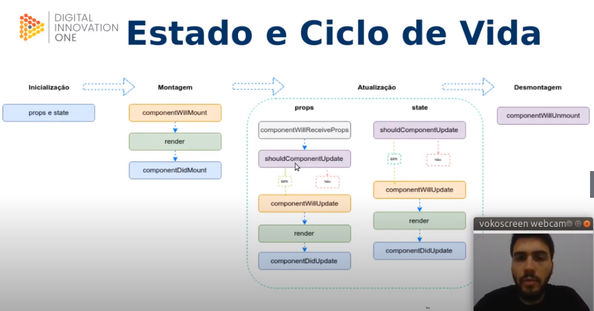

# Introdução ao ReactJS
## Conheça a tecnologia ReactJS
- Não é um framework 
- É uma biblioteca JS para criar interfaces de usuário 

- Criado em 2011 por jordan walke no facebook 
- Baseado em xhp um framework para criação html no php 
- Utilizado no mural de noticias de ferramentas 
- problemas de renderização , escalabilidade , etc 
- 2012 Instragram 
- 2013 Tornou-se Open source 
- 2015 React Native (mobile)
- 2015 UWP Universal windows plataform (desktop)
- Netflix 
- é uma linguagem declarativa (não quer saber se uma condição é satisfeita par ser exibida a interface)
- pode ser usada em celulares , pwa , frontend , backend (nextjs)
## Aprenda a configurar o ReactJS
- Renderização 
- React DOM toda renderização é feita em nós raíz
- a renderização é a menor parte para construir uma interface no react 
- o browse tem o DOM 
- o react nao trabalha em cima do dom diretamente, utiliza o Dom virtual que controla tudo que está no DOM
- Sempre que há uma mudança no html o react faz uma diferença e somente no pedaço onde há atualização é feita uma nova renderização 
## components 
- Deixa tudo modular ? 
- componentes e props 
- tornar componentizavel é bom 
- react trabalha bem com reaproveitamento de código 
- pode trabalhar como função ou classe 
- Js não tem classe , tem protótipo 
- Quando JS é transpilado as classes são transformadas em protótipos 
- components - src - index 
- npm i 
- npm run start 
- 
## Renderizando elementos 
- Estado e ciclo de vida 
- Inicialização 
- Montagem 
- Atualização 
- Desmontagem 

- nenhum componente pai ou filho devem saber se outro componente possui estado ou nao 
- o estado é apoenas local ao componente e c aso seja necessário enviar algum atributo para outro então é feito via props
## Ecossistema 
Bibliotecas complementares 
- React Router gerenciamento de estados 
- Redux 
- Material UI criação de interfaces 
- Ant-Design 
- Storybook criação de componentes 
- Gastby 
- Jest    teste 
- React i18n Next  internacionalizacao 
## Configuração 
- React Create App (starta projetos com configuração básica, servidor , Jest ... )
- Utiliza o react Scripts 
- Task Runners e Bundlers Sizers 
- npm init 
- npm install --save react@16.8.6 react-dom@16.8.6 @react-scripts3.0.1
- pasta public -> pasta inicial do projeto 
- - React requer um arquivo css
- react eh uma single page application (SPA) , baixa todo o prohjeto e renderiza uma  vez todas as rotas , toda vez que o user muda de rota , ele renderiza essa rota ( performace ) 
## JSX 
- Não é HTML nem String 
- É uma linguagem de marcação que permite criar estruturas do HTML com o poder do javascript 
- React usa componentes 
- Não é obrigatória a utilização do JSX mas facilita 
- Browser nao intepreta JSX , para isso é necessario um transpilador para a aplicação entender o código (exemplo BABEL) 
- para executar um JS dentro de um JSX deve estar entre chaves 
- 
